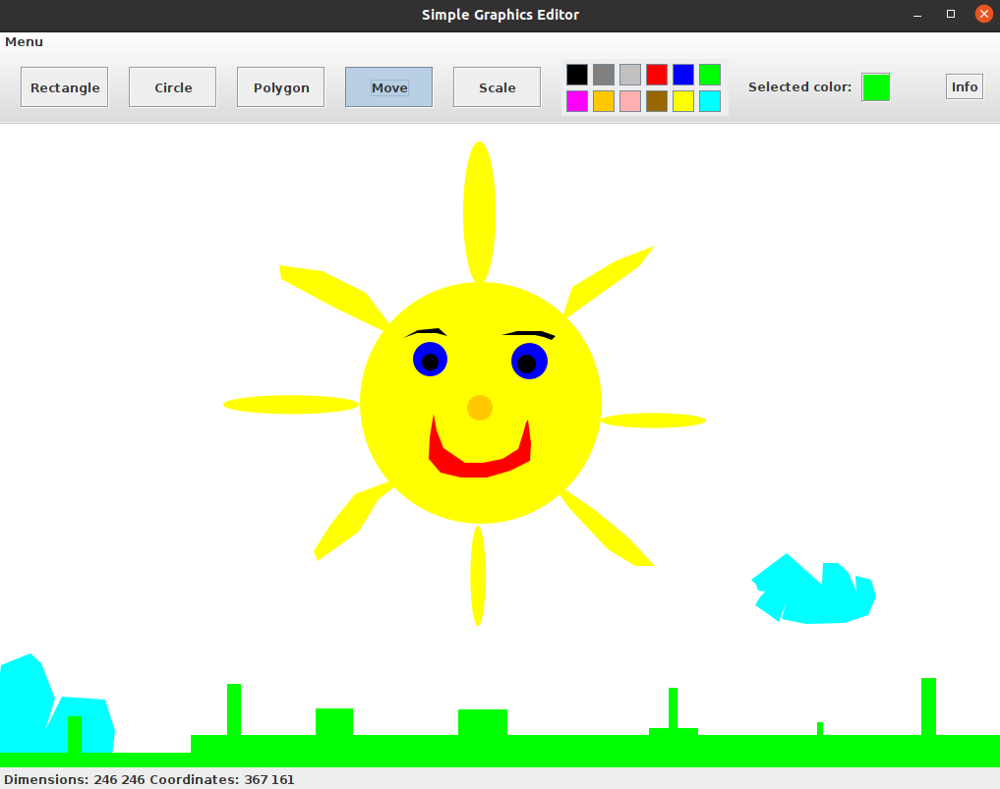

# Simple Graphics Editor

Prosty edytor graficzny napisany w **Javie**. Umożliwia tworzenie i edycję różnych figur geometrycznych w wielu kolorach. Istnieje opcja zapisania i wczytania stworzonego obrazu (wykorzystując serializację).

## Przykład

