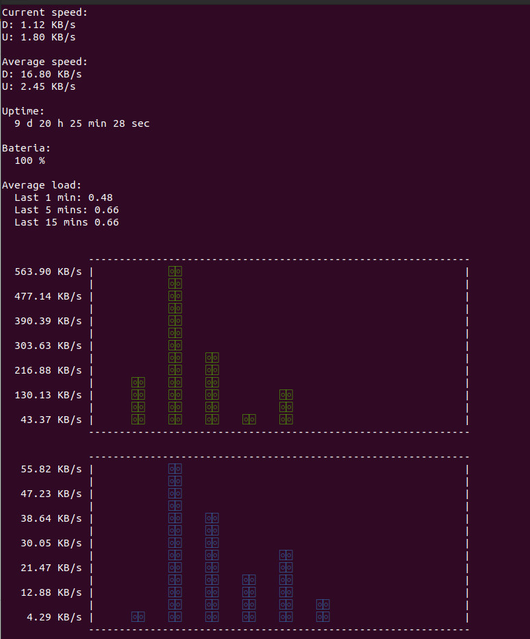

# System Monitor

Program napisany w **Bashu**, który wyświetla kilka informacji o systemie: średnie obciążenie, stan baterii, czas działania oraz prędkość pobierania i wysyłania (również na wykresie).

## Przykład

